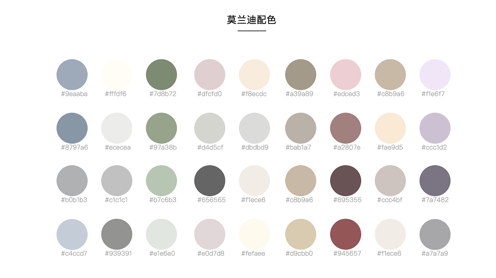

一晃上次发文已经一年过去了,这期间发生了许多事,让我无法抽出身来静下心学习和思考
索性将积累到的有用的素材,一些有趣的网站做一个集合,以作分享  

## PPT 模板  

* [第一PPT](http://www.1ppt.com/)  

## 配色方案  

* [Material UI](https://www.materialui.co/)  
* 莫兰迪色卡  
  

## AE 模板  

* [新CG儿](https://www.newcger.com/)  

## 图片素材  

* [Unsplash](https://unsplash.com/)  
* [Life of Pix](https://www.lifeofpix.com/)  
* [Pexels](https://www.pexels.com/)  

## 音乐下载  

* [音乐搜索器](http://fm.viapi.cn/)  

## 软件下载  

* [殁漂遥](https://www.laomoit.com/)  
* [易破解](http://www.ypojie.com/)  
* [Chrome下载](https://tools.shuax.com/chrome/)  
* [CRX Down](http://crxdown.com/)  
* [GuGe APPs](https://www.gugeapps.net/)  

## APK下载  

* [APKGK](https://apkgk.com/)  
* [APK.support](https://apk.support/)  
* [APK Fab](https://apkfab.com/)  

## 电视直播  

* [Radio 366](http://www.radio366.com/tv/)  
* [球头条](https://www.qttzb.com/)  

> 未完待续
